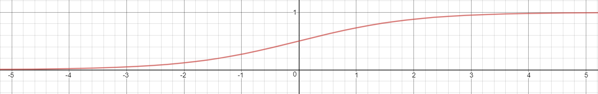
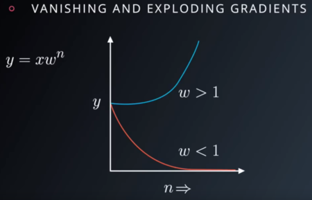
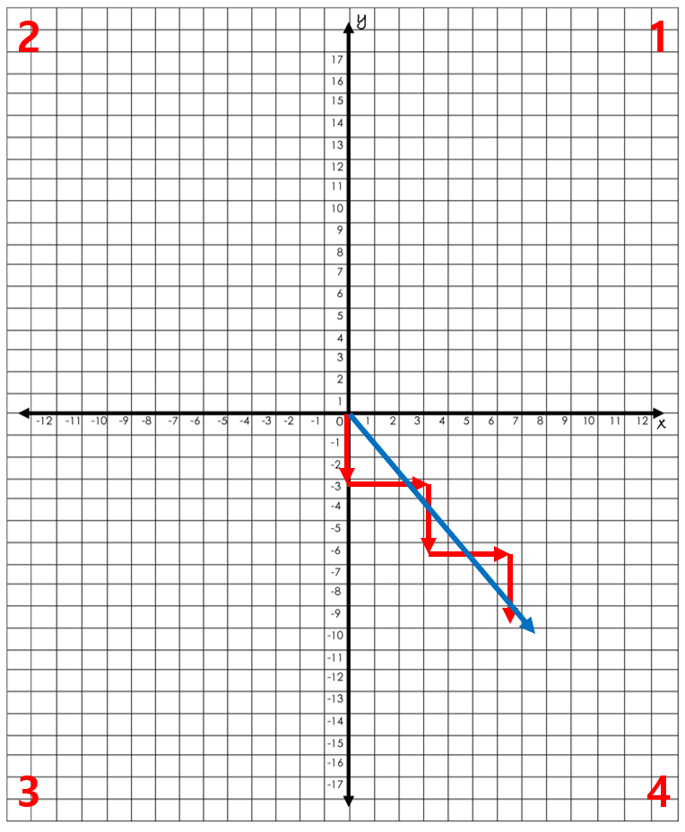
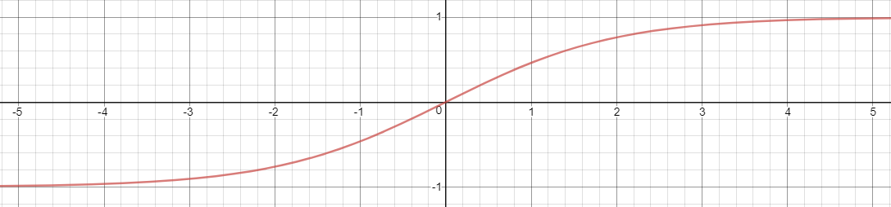
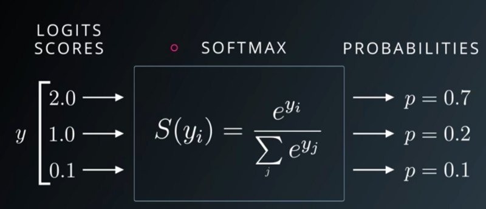

# Activation Function (활성화 함수)
## 1. Activation Function 정의
Neural Network들의 개별 뉴런에 들어오는 입력신호 (Input Signal)의 총합을 출력 (Output) 사이의 비선형 복잡한 함수 맴핑을 만드는 과정 <br />
이를 이용하여 인공 신경망은 실제로 복잡한 데이터를 배우고 모델링을 할 수 있습니다. <br />
활성화 함수의 역할 : 입력 신호의 총합이 활성화를 일으키는지 아닌지를 정하는 역할을 합니다.


### 1.1 Activation Function 필요성
활성화 함수를 사용하지 않으면 단순한 선형 함수가 됩니다. 선형 함수 쉽게 풀 수 있지만 복잡성이 제한되어 이미지, 비디오, 오디오 같은 데이터를 배울 수 없습니다. 즉, 더 복잡한 데이터를 배우기 위해서 사용합니다. (Neural Network에서의 층을 쌓는 혜택을 얻을려고)

> 선형 함수인 f(x)=cx를 활성화함수로 사용한 3층 네트워크를 만들면 y(x)=f(f(f(x)))가 됩니다. 이는 a=c^3 이라고 하면 y(x) = ax와 같은 식입니다. 즉, 은닉층이 없는 네트워크로 표현할 수 있습니다. <br />
연속적인 레이어들은 Input: x --> Hidden Layer #1 f(x) --> Hidden Layer #2 f(f(x)) --> ... 이런식으로 구성이 되는데 y(x) = f(f(f(x))) 라면 y = ax가 되어 하나의 거대한 Layer만 존재하는 꼴이 됩니다. 따라서, Neural Network에서 층을 쌓는 혜택을 얻고 싶다면 활성화함수로는 반드시 비선형 함수를 사용해야 합니다.

### 1.2 Most Popular Types of Activation Functions
#### 1.2.1 Sigmoid or Logistic
Sigmoid Activation Function 
- $f(x) = \frac{1}{1 + exp(-x)}$ 형태의 함수
- $f'(x) = f(x)(1 - f(x))$
- 범위 : 0 ~ 1, 모양 : S 커브


단점
1. Vanshing Gradient Problem (Saturation or Vanishing)

2. 출력 값이 0 ~ 1 사이 이기 때문에 최적화가 어렵습니다.
3. 수렴 되는 속도가 느립니다.
Notation : L : Loss, w : weight, x : input, δ : gradient <br />
$w_{i}$의 그래디언트는 $\frac{∂L}{∂w_{i}} = x_{i} * δ$ 입니다.
만약에 모든 input이 양수이기 때문에 δ가 양수라면 Loss에 대한 $w_{i}$에 대한 각각의 그래프는 모두 양수 <br/>
반대라면 모두 음수 값을 갖을 것 입니다.



#### 1.2.2 Hyperbolic Tangent function (Tanh)
Hyperbolic Tangent function
- $f(x) = tanh(x) = \frac{e^x - e^{-x}}{e^x + e^{-x}} = \frac{2}{1+e^{-2x}} - 1$
- $tanh'(x) = 1 - tanh^2(x)$
- 범위 -1 ~ 1, zero centered


단점 <br/>
1. Sigmoid 보다 최적화가 쉽지만 아직 Vanishing Gradient Problem이 존재한다.

#### 1.2.3 Rectified Linear Unit (ReLU)
Rectified Linear Unit
- $f(x) = max(0, x) i.e. if x < 0, f(x) = 0 and if x >= 0, f(x) = x $
- 간단하고 효율적임
- Vanising Gradient Problem을 해결!


단점 <br/>
1. Hidden Unit에서만 사용 가능하다. 
예를 들어, Classification에서의 Output Layer는 softmax, Regression에서의 Output Layer는 Linear 함수를 사용한다.
2. 학습 도중에 쉽게 죽거나 깨질 수 있다. 즉, Dead Neuron이 많이 발생한다.
Input에 대해 항상 같은 Output이 나오는 현상을 의미합니다. ReLU Neuron이 음수쪽에 갇히게 되면 항상 0을 출력하며 신경세포가 죽습니다.


#### 1.2.4 Softmax
Softmax
- $ f(x_{i}) = \frac{e^{yi}}{\sum_{j} e^{yi}} for i = 1, .. , k$
- k 차원을 갖는 벡터를 0과 1의 범위로 치환시킨다.
- 다른 뉴런의 출력값과의 상대적인 비교를 통해 최종값 결정 또한 출력값의 합이 1이 되기 때문에 Normalization 효과를 얻게 된다.
- 확률 처럼 사용이 가능하다.




```python

```
