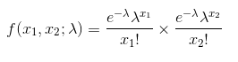
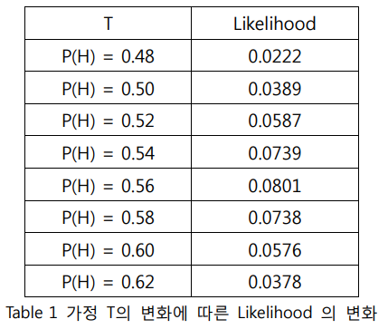
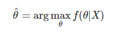

# Random Variable의 Parameter를 Estimation 하는 방법 - MLE와 MAP
Maximum Likelihood Estimation와 Maximum a Posteriori Estimation은 기초적인 통계분석, 회귀분석등 다양한 통계분석에서 사용됩니다. 또 추출된 데이터를 통해서 어떤 값에 대한 추정치를 계산하는 방법으로 자주 등장합니다.

## 0. Probability V.S. Likelihood
- 가설 : T, 증거 : E 라고 정의할 때
- P(E|T) : 가설 T가 전제 되었을 때, 증거 E가 등장할 확률
- L(T|E) : 증거 E가 관측 되었을 때, 가설 T가 전제될 가능도
- P(E|T)와 L(T|E)는 비례하기 때문에 두 개를 최대화하는 과정은 동일하다.

## 1. Bayesian Theorem
### Bayesian Theorem 요소
- 사전 확률 (Prior Probability)  : 이미 알고 있는 확률 (P(A) 또는 P(B))
- 우도 (Likelihood Probability) : 이미 알고 있는 사건(들)이 발생되었을 때, 다른 사건이 발생할 확률 (P(B|A))
- 사후확률 (Posteriori Probability) : 사전확률과 우도확률을 통해서 알게되는 조건부 확률 P(A|B)

P(A|B) = P(B|A)P(A) / P(B)

> P(A|B) = P(A ∩ B) / P(L) 형태로도 계산할 수 있지만 사전 확률의 변수가 여러 개가 되면 계산하는 게 힘들어진다. 따라서 P(A|B) = P(B|A)P(A) / P(B) 형태로 계산하는 것이 더 빠르다.

## 2. Maximum Likelihood Estimation (MLE)
### 오직 주어진 데이터 또는 Observation을 토대로 Parameter Estimation 하는 방법
가설들의 확률들을 비교하여 가능도 (Likelihood)가 가장 큰 가설을 선택하는 방법

가정
- F0 : Unkown Probability Density Function 가 있다고 가정
- X = (x1, x2, x3, ... , xn)를 그 확률로 생성된 Observation
- Density function이 θ 로 parameterize된 어떤 분포의 family라고 가정
- 그러면 Observation X가 주어진다면, θ의 값만 알수 있다면 f(X|θ)를 계산 가능

<b> Likelihood 정의 : 
L(θ;  x1, x2, x3, ... , xn) = L(θ; X) = f(X|θ) = f(x1, x2, x3, ... , xn|θ) = f(x1|θ)f(x2|θ). . .f(x2|θ) = ∏ni=1f(xi|θ)</b>
-  포아송 분포일 경우

<b> Maximum Likelihood Estimation (MLE) - θ^ : Likelihood를 최대로 만드는 값을 선택   </b>

### Example of Maximum Likelihood Estimation - 동전 던지기
 100번의 동전을 던졌을 때 앞면이 56번 나왔다면 '동전을 던졌을 때 앞면이 나올 확률' 을 구하는 예제
 > P(H) : 동전을 던졌을 때 앞면이 나올 확률
 > L(P(H) = T|O) = 100!/56!44! * T56(1-T)44 정의
 > L(P(H) = T|O) 가 최대가 되는 T를 찾으면 Maximum Likelihood를 찾을 수 있다.

> 위 표와 같이 0.56 일 때가 L(P(H) = T|E) 가 최대가 된다.

## 3. Maximum a Posteriori Estimation (MAP)
### 주어진 데이터에 대해 최대확률을 갖는 θ 를 찾는 방법

위에서 설명한 Maximum Likelihood Estimation의 경우 오직 지금 주어진 데이터만을 잘 설명하는 Parameter를 찾게 된다. 위에 예제 처럼 동전을 100번 던졌는 데, 100번 앞면이 나오게 되면 모든 동전을 던졌을 때 모두 앞면이라고 할 수 있을까? 우리는 여기서 좀 더 관측된 Observation에 대해 더 잘 설명하는 다른 방법이 필요하다. 즉, 데이터가 주어졌을 때, 가장 확률이 높은 θ를 고르는 방법을 택해야한다.

수식 : 

우리는 f(θ|X)는 알지 못하지만 f(X), f(θ), f(X|θ) 값들을 알고 있다. 알고 있는 값들을 이용하여 Bayesian Theorem를 사용하면 f(θ|X)를 구할 수 있다.

> f(θ|X) = f(X|θ)f(θ) / f(X) = L(θ; X)f(θ) / f(X)

### Example of Maximum a Posteriori Estimation
위와 같이 동전으로 예제를 들면 
일반적으로 우리가 알고 있는 동전의 앞면이 나올 확률은 0.5이고 이를 검증하기 위해서 100번 던졌다고 했을 때 그 결과가 70번 앞면이 나왔다면 앞에서 사용한 Maximum Likelihood Estimation을 사용한다면 앞면이 나올 확률이 0.5는 반영이 되지 않고 측정 값인 70번 앞으로 나온 것으로면 확률을 추측 할 것이다.

하지만 Maximum a Posteriori Estimation을 사용하게 되면
P(T=0.5|E=0.7) = P(E=0.7|T=0.5) P(T=0.5) / P(E=0.7) 의 수식을 세울 수 있다.
이를 위에 식에서 동전의 앞면이 나올 확률의 가정을 변수 x로 바꾸면
P(T=x|E=0.7) = P(E=0.7|T=x) P(T=x) / P(E=0.7)가 되고 이를 최대값을 구하는 과정이 Maximum a Posteriori Estimation이다.

SanghyukChun's Blog - http://sanghyukchun.github.io/58/ 참고