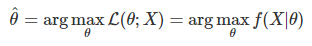

# Random Variable의 Parameter를 Estimation 하는 방법 - MLE와 MAP
## Maximum Likelihood Estimation (MLE)
### 오직 주어진 데이터 또는 Observation을 토대로 Parameter Estimation 하는 방법
- Unkown Probability Density Function F0가 있다고 가정
- X = (x1, x2, x3, ... , xn)를 그 확률로 생성된 Observation
- Density function이 θ 로 parameterize된 어떤 분포의 family라고 가정
- 그러면 Observation X가 주어진다면, θ의 값만 알수 있다면 f(X|θ)를 계산 가능
- <b> Likelihood 정의 : L(θ;  x1, x2, x3, ... , xn) = L(θ; X) = f(X|θ) = f(x1, x2, x3, ... , xn|θ) </b>
-<b> Maximum Likelihood Estimation (MLE) - θ^ : Likelihood를 최대로 만드는 값을 선택   </b>

MLE - Ex)  
바닥에 떨어진 머리카락의 길이(x)을 보고 남녀인지 성별(y)을 판단하는 문제  
남자를 y1이고 여자는 y2로 정했을 때  
P(x|y1) = 남자에게서 주어진 머리카락의 길이가 나올 확률  
P(x|y2) = 여자에게서 주어진 머리카락의 길이가 나올 확률  

## Maximum a Posteriori Estimation (MAP)

SanghyukChun's Blog - http://sanghyukchun.github.io/58/ 참고