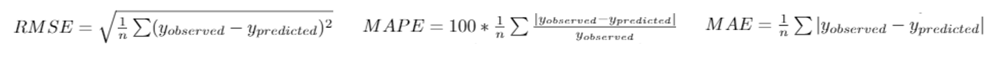

# Regression 모델 성능 평가 척도

실수 값을 예측하는 Regression은 Accuracy를 구하는 것은 조금 애매합니다. 따라서 Regression에 맞는 다른 Metric들이 필요하며 그 Metric들을 아래에서 설명하려고 합니다. 각각의 Metric들은 장단점을 가지고 있고 상황에 맞게 잘 사용해야 합니다.

---

## 수식 :


- 이 Metric들은 모두 0에 가까울수록 좋습니다.

---


## 1. RMSE (Root Mean Squared Error)

### 특징
#### 1. 모델의 예측 값과 실제 값 차이는 하나의 숫자로 표현 가능합니다. <br />

ex) 기온을 예측하는 모델이 있고 실제 값은 15도이고 예측 값을 18이라고 하였을 때 RMSE는 3이 됩니다. <br />
이처럼 RMSE는 예측 값과 실제 값의 차이를 쉽게 비교 할 수 있습니다.

#### 2. 위에 수식을 보면 실제 값과 예측 값의 차이를 제곱을 하고 평균을 내기 때문에 큰 오류에 대해 높은 가중치를 줍니다.

큰 오류가 없어야 하는 경우에 사용합니다.

<br />

### 단점
#### 1. 예측 대상의 크기에 영향을 많이 받습니다. (크기 의존적 에러 Scale-dependent Error) <br />

ex) A회사의 주가는 300만원이고 B회사의 주가는 5000원입니다. <br />
두 개의 회사 주가를 예측하는 모델을 만들었고 RMSE가 500이라고 가정을 합니다. <br />
이때 B회사 주가를 예측 모델의 변동폭은 A회사의 주가를 예측하는 모델의 경우 변동폭보다 훨씬 크다는 것을 알 수 있습니다. <br />
이처럼 같은 값이지만 크기에 따라 변동폭이 달라집니다.

<br />

### Python 코드

<br />

```python
from sklearn.metrics import mean_squared_error
from math import sqrt

rms = sqrt(mean_squared_error(y_test, y_pred))
```

---

## 2. MAE (Mean Absolute Error)
### 특징
#### 1. 이해하기 쉽고 계산이 쉽습니다.

#### 2. 모든 예측 값과 실제 값의 개인차가 똑같이 가중이 됩니다.

#### 3. Outlier에 대해 민감하지 않습니다.

### Python 코드

<br />

```python
from sklearn.metrics import mean_absolute_error

mae = mean_absolute_error(y_test, y_pred)
```
---

## 3. MAPE (Mean Absolute Percentage Error)
