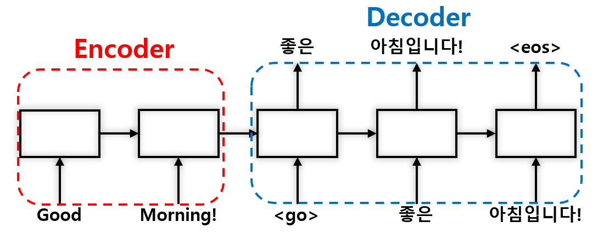
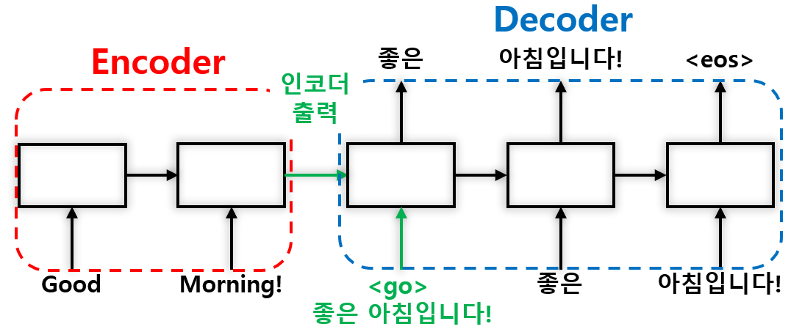

# Seq2Seq Model
## Structure
크게 <b> 인코더(Encoder)와 디코더(Decoder) </b> 두 부분으로 나뉩니다.  
<b> 인코더 (Encoder)는 Source 정보를 압축 </b> ex) 번역기 - 영어  
<b> 디코더 (Decoder)는 Target 정보를 출력 </b> ex) 번역기 - 한국어    
아래 그림처럼 Good Morning! 이라는 단어를 인코더(Encoder) 넣으면 Feature를 압축합니다.  
디코더(Decoder)는 좋은 아침입니다! 라는 문장을 출력합니다.  

  

## Training and Testing(Prediction)
<b>학습과정과 테스트(예측)과정이 조금 다릅니다. (디코더(Decoder) 부분이 다릅니다.) </b>   
### 학습과정 :  
디코더 (Decoder)는 인코더 (Encoder)가 보내온 정보 (압축된 정보)와 실제 정답을 가지고 학습을 합니다.   
아래 그림과 같이 인코더 (Encoder)의 출력 값과 정답 (\<go\> 포함)을 넣어 학습합니다.  
- \<go\>와 \<eos\>는 정답의 시작과 끝은 알리는 기호입니다.  
  

### Seq2Seq Video

처음에 input으로 시작하여 각 time step 마다 이전 hidden state와 input을 받아서 다음 layer로 넘어간다.  
Encoder가 끝난 후 Encoder의 마지막 hidden state가 Decoder로 들어가고 각 step에서의 Output을 뱉는다.  

### 테스트 (예측) 과정  
아래 그림과 같이 코더 (Encoder)의 출력 값과 학습과정과 다르게 정답이 없기 때문에 시작을 알리는 \<go\>를 넣습니다.  
그러면 모델이 첫 결과물을 출력하고 이를 바탕으로 다음 입력으로 넣습니다.  
마지막으로는 끝을 알리는 \<eos\>를 출력합니다.  

