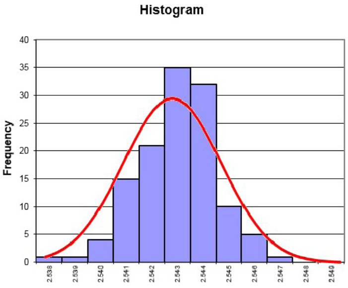
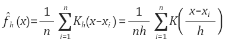
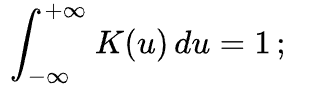
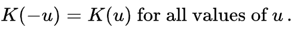
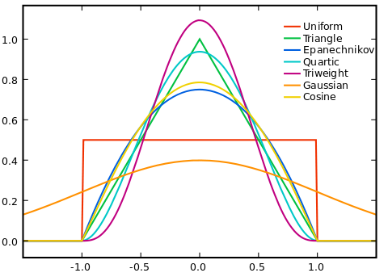

# Support Vector Regression 설명
-----

## 0. Kernal Function
### 0.1 통계적 추정 : 관측된 데이터로 부터 전체 모집단을 추정하는 방법
<b>모수적 추정</b> : 확률 밀도가 정해진 방법 ex) 정규 분포, 베르누이 분포 등  
<b>비모수적 추정</b> : 확률 밀도가 정해지지 않은 방법 -> 즉, 관측된 데이터를 기반으로 만듬 ex) 히스로그램을 통해서 구하기

히스토그램으로 통해서 구하는 방법에는 단점이 존재합니다.
### 0.2 히스토그램 단점
1. bin 경계 부분에서 불연속성
2. 같은 bin 안에 있으면 x값이 같음

이런 단점을 해결하기 위해서 커널 밀도 추정 (Kernel Density Estimation)을 사용합니다.

### 0.3 커널 밀도 추정 (Kernel Density Estimation)
- 수식

- Notation
X : 구하고자 하는 변수, Xi : 관측 데이터, Kh : 커널 함수
h : 커널 함수의 bandwidth 파라미터 (High h : 완만한 형태, Low h : 뾰족한 형태)

- 이해
1. 관측 데이터 각각 마다 해당 데이터 값을 중심으로 하는 커널 함수 생성
2. 커널 함수들을 모두 더한 후, 전체 데이터 수로 나누기

### 0.4 커널 함수 (Kernel Function)
- 정의 

적분값이 1이고 non-negative function

원점 중심의 대칭

- 함수 예제

참고 : http://darkpgmr.tistory.com/147

----

## 1. Support Vector Regression

전통적인 Regression 방법 중의 하나로써 SVM 과 같이 입력 데이터에서 단순한 초평면hyperplane으로 정의되지 않는 더 복잡한 모델을 만들 수 있도록 확장한 것입니다.

입력 데이터 : xi ∈ Rn, 목표 값 : yi ∈ R
### 1-1. 수식 f(xi) = wTϕ(xi) + b
비선형 커널 함수 ϕ(·) : Rn -> Rm
SVR은 입력데이터를 비선형 커널 함수에 의해 고차원의 커널 Feature space로 mapping 시킵니ㅏㄷ.
이를 바탕으로 형상공간에서 선형함수를 탐색하는 문제로 재정의 할 수 있다.
즉, 새로 얻어진 선형 공간에서 추정함수 f(xi)를 찾는 것이다.

### 1-2 .Notation
w : 특정 공간에서 가중치 백터, wT : w의 전치 행렬, b : 상수항

### 1-3. 목표
추정 함수 f가 flat해지기 위해서는 w 값이 작아져야 함 -> 즉, Norm 이 최소를 가져야 함 (||w||2 = < w, w>)

참고 : Noise Removal using Support Vector Regression in Noisy Document Images

----

