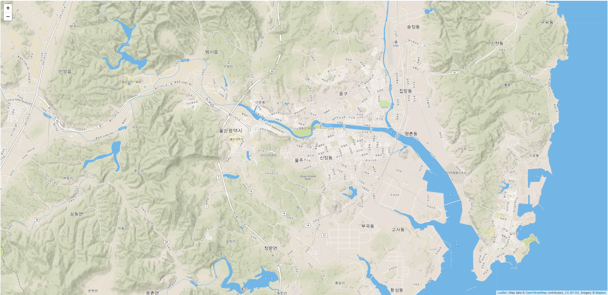

# Leaflet 기초

## Leaflet CSS file 추가
```xml
<link rel="stylesheet" href="https://unpkg.com/leaflet@1.4.0/dist/leaflet.css"
   integrity="sha512-puBpdR0798OZvTTbP4A8Ix/l+A4dHDD0DGqYW6RQ+9jxkRFclaxxQb/SJAWZfWAkuyeQUytO7+7N4QKrDh+drA=="
   crossorigin=""/>
```

CSS 파일 추가한 후 JS 파일 추가해야 합니다!

## Leaflet JS file 추가
```xml
 <!-- Make sure you put this AFTER Leaflet's CSS -->
 <script src="https://unpkg.com/leaflet@1.4.0/dist/leaflet.js"
   integrity="sha512-QVftwZFqvtRNi0ZyCtsznlKSWOStnDORoefr1enyq5mVL4tmKB3S/EnC3rRJcxCPavG10IcrVGSmPh6Qw5lwrg=="
   crossorigin=""></script>
```

## Map div 및 css 추가

- id가 mapid 인 div를 html파일 <body></body>안에 추가합니다.
```html
 <div id="mapid"></div>
```

- 외부 stylesheet 파일이나 html 파일 <style></style> 안에 id가 mapid인 요소의 height를 1080px로 지정합니다.
```css
 #mapid { height: 1080px; }
```

## Map 위치 정하기 
- 울산광역시로 정해보겠습니다.
- 외부 javascript 파일이나 html 파일 <script></script> 안에 지도의 관점을 셋팅합니다.
- 아래 코드는 Map div 코드보다 아래에 있어야 합니다.
> setView 함수
> Parameters
> LatLng : 위도 경도, Number : 줌 레벨, Zoom/pan options?
```js
var mymap = L.map('mapid').setView([51.505, -0.09], 13);
```

여기까지하면 설정이 되지만 Map 타일이 없어서 지도가 나오지 않습니다.

## Map Tile 설정
- 아래 코드와 같이 입력해주시면 됩니다.
- accessToken을 https://account.mapbox.com/access-tokens/ 이 사이트에서 만들 수 있습니다.
```js
L.tileLayer('https://api.tiles.mapbox.com/v4/{id}/{z}/{x}/{y}.png?access_token={accessToken}', {
    attribution: 'Map data &copy; <a href="https://www.openstreetmap.org/">OpenStreetMap</a> contributors, <a href="https://creativecommons.org/licenses/by-sa/2.0/">CC-BY-SA</a>, Imagery © <a href="https://www.mapbox.com/">Mapbox</a>',
    maxZoom: 18,
    id: 'mapbox.streets',
    accessToken: 'your.mapbox.access.token'
}).addTo(mymap);
```

- 결과 


[Leaflet 주소](https://leafletjs.com/).


```python

```
